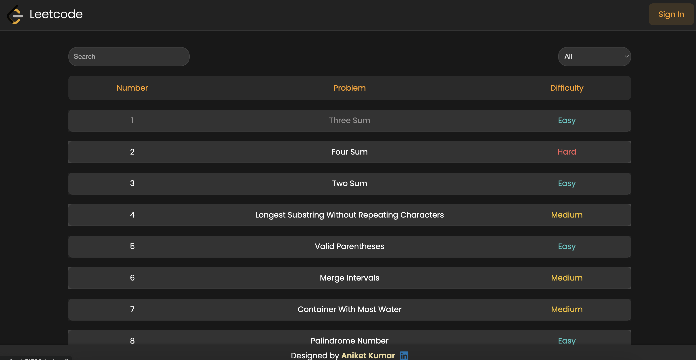

# LeetCode Clone

## Overview

**LeetCode Clone** is a web application that mimics the core functionality of the popular coding platform **LeetCode**. Users can access coding problems, attempt to solve them in an embedded **Monaco Editor**, and participate in discussions by posting and reading comments. The platform integrates **Firebase Authentication** for secure login and provides real-time commenting on each problem.

The project leverages **React** for the frontend, **Firebase** for backend services, and **Monaco Editor** for a rich code editor experience.

---

## Live Link

You can access the live version of the project at:

**[Live Project Link](https://leetcode-clone-aniket.vercel.app/)**

---

## Features

- **Google Authentication via Firebase**: Users can log in using their Google accounts.
- **Problem-Solving Interface**: Users can view coding problems and attempt to solve them directly in the browser.
- **Monaco Editor Integration**: A fully-featured code editor embedded into the platform, providing features like syntax highlighting, IntelliSense, error checking, and more.
- **Dynamic Problem Navigation**: Navigate through multiple problems and move to the next or previous one.
- **Real-time Comments**: Users can post and read comments for each problem, with real-time updates using Firebase.
- **Responsive Design**: The platform is fully responsive and works seamlessly across devices like mobile, tablet, and desktop.
- **State Management using Context API**: Context API is used to manage global states, such as user login status and current problem.
- **Post and Display Comments**: Real-time addition of comments and responses in discussions.
- **Styling**: CSS Modules are used for scoped and maintainable styles.

---
